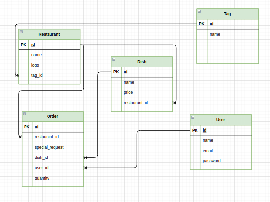

# vertilogic-yumfood

# Schema



# **API Docs**

# Vendors API

**GET /api/v1/vendors**
---
* **Method:**

    `GET`
  
*  **URL Params**

    None

*  **URL Query**

    `tags[]=<Tags> (Optional)`

*  **Headers**

    None

* **Data Params**

    None

* **Success Response:**

    **Code:** 200 <br />
    **Content:** 
    ```json
    { 
      "data": [
        {
          "id": <id>,
          "name": <name>,
          "logo": <logo>,
          "TagId": <TagId>,
          "createdAt": <createdAt>,
          "updatedAt": <updatedAt>,
          "Dishes": [
            {
              "id": <id>,
              "name": <name>,
              "price": <price>,
              "RestaurantId": <RestaurantId>,
              "createdAt": <createdAt>,
              "updatedAt": <updatedAt>,
            }
          ],
          "Tag": {
            "id": <id>,
            "name": <name>,
            "createdAt": <createdAt>,
            "updatedAt": <updatedAt>,
          }
        }
      ]
    }
    ```
 
* **Error Response:**

    **Code:** 500 Internal Server Error <br />
    **Content:**
    ```json
    {
      "message": "Internal Server Error"
    }
    ```

**GET /api/v1/vendors/:id**
---
* **Method:**

    `GET`
  
*  **URL Params**

    `id=<integer> (required)`

*  **URL Query**

    None

*  **Headers**

    None

* **Data Params**

    None

* **Success Response:**

    **Code:** 200 <br />
    **Content:** 
    ```json
    { 
      "data": {
        "id": <id>,
        "name": <name>,
        "logo": <logo>,
        "TagId": <TagId>,
        "createdAt": <createdAt>,
        "updatedAt": <updatedAt>,
        "Dishes": [
          {
            "id": <id>,
            "name": <name>,
            "price": <price>,
            "RestaurantId": <RestaurantId>,
            "createdAt": <createdAt>,
            "updatedAt": <updatedAt>,
          }
        ],
        "Tag": {
          "id": <id>,
          "name": <name>,
          "createdAt": <createdAt>,
          "updatedAt": <updatedAt>,
        }
      }
    }
    ```
 
* **Error Response:**

    **Code:** 500 Internal Server Error <br />
    **Content:**
    ```json
    {
      "message": "Internal Server Error"
    }
    ```

    OR

    **Code:** 404 Not Found <br />
    **Content:**
    ```json
    {
      "message": "Error Not Found"
    }
    ```

**POST /api/v1/vendors/**
---
* **Method:**

    `POST`
  
*  **URL Params**

    None

*  **URL Query**

    None

*  **Headers**

    None

* **Data Params**

    ```json
      "name": <name>,
      "logo": <logo>,
      "TagId": <TagId>
    ```

* **Success Response:**

    **Code:** 200 <br />
    **Content:** 
    ```json
    { 
      "data": {
        "id": <id>,
        "name": <name>,
        "logo": <logo>,
        "TagId": <TagId>,
        "createdAt": <createdAt>,
        "updatedAt": <updatedAt>
      }
    }
    ```
 
* **Error Response:**

    **Code:** 500 Internal Server Error <br />
    **Content:**
    ```json
    {
      "message": "Internal Server Error"
    }
    ```

**PUT /api/v1/vendors/:id**
---
* **Method:**

    `PUT`
  
*  **URL Params**

    `id=<integer> (required)`

*  **URL Query**

    None

*  **Headers**

    None

* **Data Params**

    ```json
      "name": <name>,
      "logo": <logo>,
      "TagId": <TagId>
    ```

* **Success Response:**

    **Code:** 200 <br />
    **Content:** 
    ```json
    { 
      "data": {
        "id": <id>,
        "name": <name>,
        "logo": <logo>,
        "TagId": <TagId>,
        "createdAt": <createdAt>,
        "updatedAt": <updatedAt>
      }
    }
    ```
 
* **Error Response:**

    **Code:** 500 Internal Server Error <br />
    **Content:**
    ```json
    {
      "message": "Internal Server Error"
    }
    ```

    OR

    **Code:** 404 Not Found <br />
    **Content:**
    ```json
    {
      "message": "Error Not Found"
    }
    ```

**DELETE /api/v1/vendors/:id**
---
* **Method:**

    `DELETE`
  
*  **URL Params**

    `id=<integer> (required)`

*  **URL Query**

    None

*  **Headers**

    None

* **Data Params**

    None

* **Success Response:**

    **Code:** 200 <br />
    **Content:** 
    ```json
    { 
      "message": "Data deleted"
    }
    ```
 
* **Error Response:**

    **Code:** 500 Internal Server Error <br />
    **Content:**
    ```json
    {
      "message": "Internal Server Error"
    }
    ```

    OR

    **Code:** 404 Not Found <br />
    **Content:**
    ```json
    {
      "message": "Error Not Found"
    }
    ```

# Dishes API

**GET /api/v1/dishes**
---
* **Method:**

    `GET`
  
*  **URL Params**

    None

*  **URL Query**

    `RestaurantId=<integer> (Required)`

*  **Headers**

    None

* **Data Params**

    None

* **Success Response:**

    **Code:** 200 <br />
    **Content:** 
    ```json
    { 
      "data": [
        {
          "id": <id>,
          "name": <name>,
          "price": <price>,
          "RestaurantId": <RestaurantId>,
          "createdAt": <createdAt>,
          "updatedAt": <updatedAt>
        }
      ]
    }
    ```
 
* **Error Response:**

    **Code:** 500 Internal Server Error <br />
    **Content:**
    ```json
    {
      "message": "Internal Server Error"
    }
    ```

    OR

    **Code:** 400 Bad Request <br />
    **Content:**
    ```json
    {
      "message": "Query Required"
    }
    ```

**POST /api/v1/dishes**
---
* **Method:**

    `POST`
  
*  **URL Params**

    None

*  **URL Query**

    None

*  **Headers**

    None

* **Data Params**

    ```json
    {
      "name": <name>,
      "price": <price>,
      "RestaurantId": <RestaurantId>
    }
    ```

* **Success Response:**

    **Code:** 200 <br />
    **Content:** 
    ```json
    { 
      "data": {
        "name": <name>,
        "price": <price>,
        "RestaurantId": <RestaurantId>,
        "createdAt": <createdAt>,
        "updatedAt": <updatedAt>
      }
    }
    ```
 
* **Error Response:**

    **Code:** 500 Internal Server Error <br />
    **Content:**
    ```json
    {
      "message": "Internal Server Error"
    }
    ```

# Orders API

**GET /api/v1/orders**
---
* **Method:**

    `GET`
  
*  **URL Params**

    None

*  **URL Query**

    None

*  **Headers**

    None

* **Data Params**

    None

* **Success Response:**

    **Code:** 200 <br />
    **Content:** 
    ```json
    { 
      "data": [
        {
          "id": <id>,
          "special_request": <special_request>,
          "quantity": <quantity>,
          "RestaurantId": <RestaurantId>,
          "DishId": <DishId>,
          "UserId": <UserId>,
          "createdAt": <createdAt>,
          "updatedAt": <updatedAt>,
          "Restaurant": {
            "id": <id>,
            "name": <name>,
            "logo": <logo>,
            "TagId": <TagId>,
            "createdAt": <createdAt>,
            "updatedAt": <updatedAt>
          },
          "Dish": {
            "id": <id>,
            "name": <name>,
            "price": <price>,
            "RestaurantId": <RestaurantId>,
            "createdAt": <createdAt>,
            "updatedAt": <updatedAt>
          },
          "User": {
            "id": <id>,
            "name": <name>,
            "email": <email>
          }
        }
      ]
    }
    ```
 
* **Error Response:**

    **Code:** 500 Internal Server Error <br />
    **Content:**
    ```json
    {
      "message": "Internal Server Error"
    }
    ```

**POST /api/v1/orders**
---
* **Method:**

    `POST`
  
*  **URL Params**

    None

*  **URL Query**

    None

*  **Headers**

    None

* **Data Params**

    ```json
    {
      "special_request": <special_request>,
      "quantity": <quantity>,
      "RestaurantId": <RestaurantId>,
      "DishId": <DishId>,
      "UserId": <UserId>
    }
    ```

* **Success Response:**

    **Code:** 200 <br />
    **Content:** 
    ```json
    { 
      "data": {
        "special_request": <special_request>,
        "quantity": <quantity>,
        "RestaurantId": <RestaurantId>,
        "DishId": <DishId>,
        "UserId": <UserId>,
        "createdAt": <createdAt>,
        "updatedAt": <updatedAt>,
      }
    }
    ```
 
* **Error Response:**

    **Code:** 500 Internal Server Error <br />
    **Content:**
    ```json
    {
      "message": "Internal Server Error"
    }
    ```